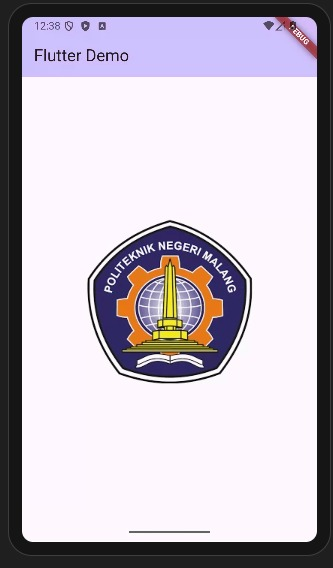
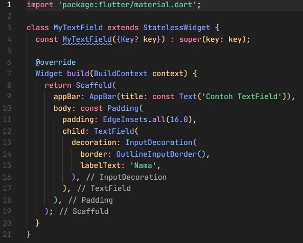

<!-- praktikum 4.1 -->

<b>praktikum-04 langkah 01</b>

<table>
  <tr>
    <td align="center"><b>Kode</b></td>
    <td align="center"><b>Output</b></td>
  </tr>
  <tr>
    <td></td>
    <td></td>
  </tr>
</table>

<!-- praktikum 4.2 -->

<b>praktikum-04 langkah 02</b>

<table>
  <tr>
    <td align="center"><b>Kode</b></td>
    <td align="center"><b>Output</b></td>
  </tr>
  <tr>
    <td></td>
    <td></td>
  </tr>
</table>

<!-- praktikum 5.1 -->
---

<b>praktikum-05 langkah 01</b>

<table>
  <tr>
    <td align="center"><b>Kode</b></td>
    <td align="center"><b>Output</b></td>
  </tr>
  <tr>
    <td>
      
    </td>
    <td>
       
      
    </td>
  </tr>
</table>

<!-- praktikum 5.2 -->
---

<b>praktikum-05 langkah 02</b>

<table>
  <tr>
    <td align="center"><b>Kode</b></td>
    <td align="center"><b>Output</b></td>
  </tr>
  <tr>
    <td></td>
    <td></td>
  </tr>
</table>

<!-- praktikum 5.3 -->
---

<b>praktikum-05 langkah 03</b>

<table>
  <tr>
    <td align="center"><b>Kode</b></td>
    <td align="center"><b>Output</b></td>
  </tr>
  <tr>
    <td></td>
    <td></td>
  </tr>
</table>

<!-- praktikum 5.4 -->
---

<b>praktikum-05 langkah 04</b>

<table>
  <tr>
    <td align="center"><b>Kode</b></td>
    <td align="center"><b>Output</b></td>
  </tr>
  <tr>
    <td>
      
    </td>
    <td>
       
      
    </td>
  </tr>
</table>

<!-- praktikum 5.5 -->
---

<b>praktikum-05 langkah 05</b>

<table>
  <tr>
    <td align="center"><b>Kode</b></td>
    <td align="center"><b>Output</b></td>
  </tr>
  <tr>
    <td></td>
    <td></td>
  </tr>
</table>

<!-- praktikum 5.6 -->
---

<b>praktikum-05 langkah 06</b>

<table>
  <tr>
    <td align="center"><b>Kode</b></td>
    <td align="center"><b>Output</b></td>
  </tr>
  <tr>
    <td>
      
    </td>
    <td>
       
      
    </td>
  </tr>
</table>
