<!-- praktikum 1.2 -->

<b>praktikum-01 langkah 02</b>

<table>
  <tr>
    <td align="center"><b>Kode</b></td>
    <td align="center"><b>Output</b></td>
  </tr>
  <tr>
    <td>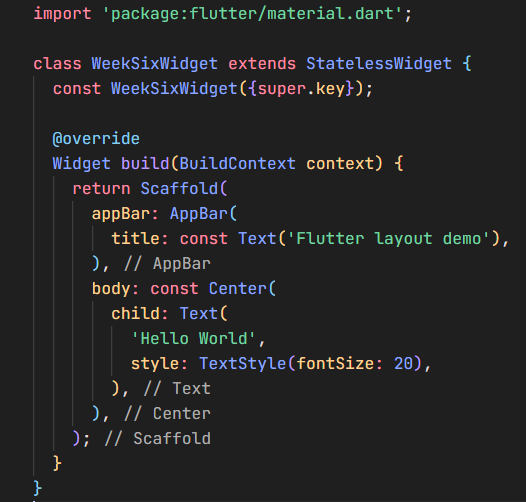</td>
    <td>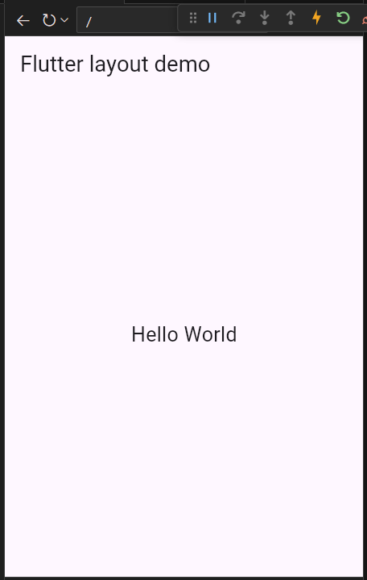</td>
  </tr>
</table>

<!-- praktikum 1.4 -->

<b>praktikum-01 langkah 04</b>

<table>
  <tr>
    <td align="center"><b>Kode</b></td>
    <td align="center"><b>Output</b></td>
  </tr>
  <tr>
    <td>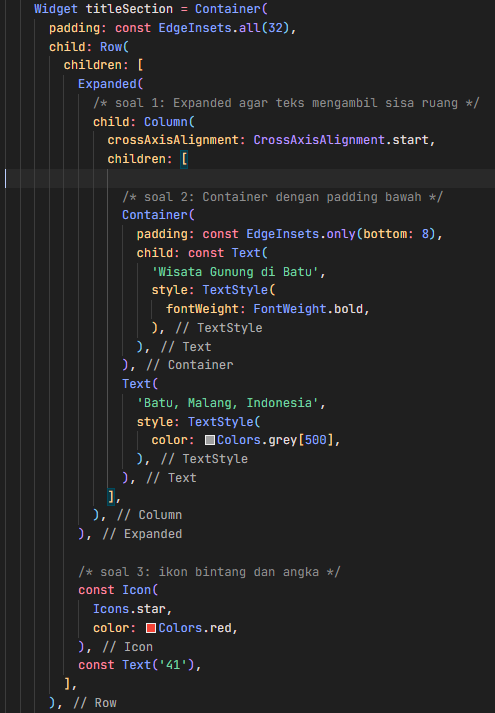</td>
    <td>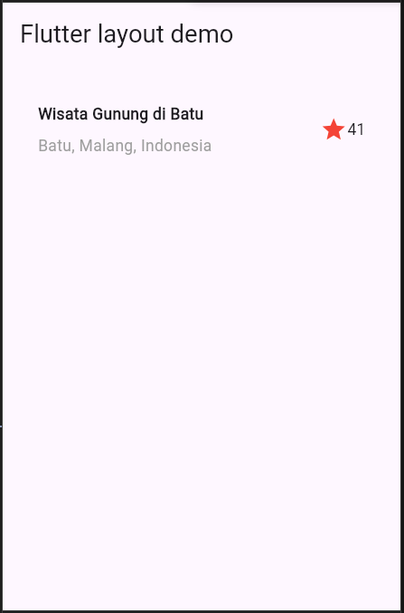</td>
  </tr>
</table>

<!-- praktikum 2.2 -->

<b>praktikum-02 langkah 02</b>

<table>
  <tr>
    <td align="center"><b>Kode</b></td>
    <td align="center"><b>Output</b></td>
  </tr>
  <tr>
    <td>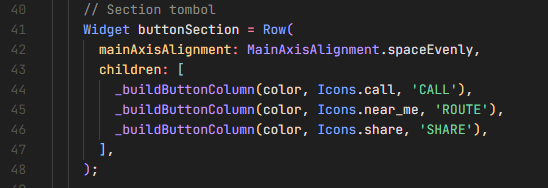</td>
    <td>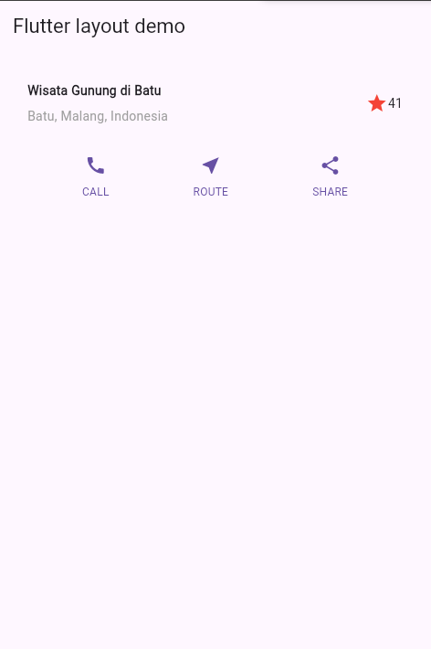</td>
  </tr>
</table>

<!-- praktikum 3.1 -->

<b>praktikum-03 langkah 01</b>

<table>
  <tr>
    <td align="center"><b>Kode</b></td>
    <td align="center"><b>Output</b></td>
  </tr>
  <tr>
    <td>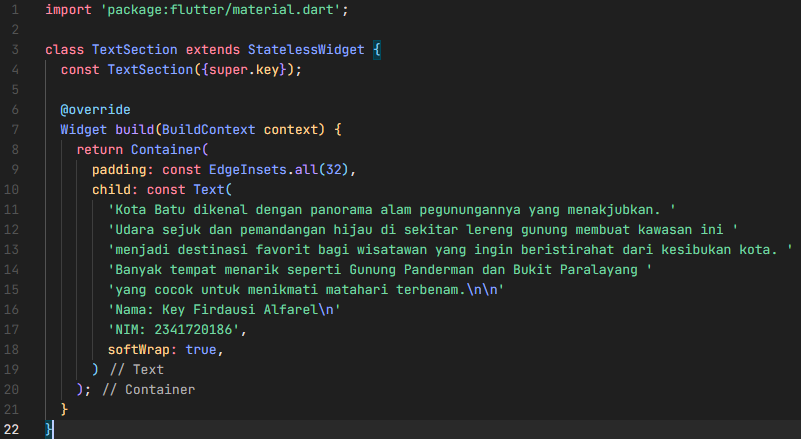</td>
    <td>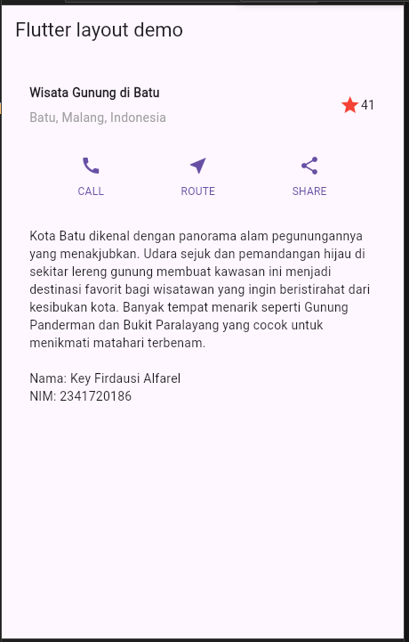</td>
  </tr>
</table>

<!-- praktikum 4.1 -->

<b>praktikum-04 langkah 01</b>

<table>
  <tr>
    <td align="center"><b>Kode</b></td>
    <td align="center"><b>Output</b></td>
  </tr>
  <tr>
    <td>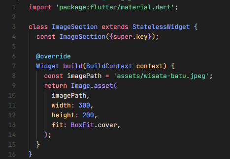</td>
    <td>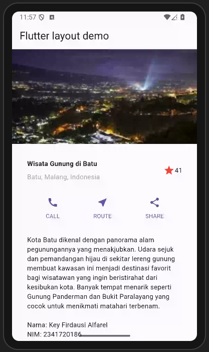</td>
  </tr>
</table>

<!-- praktikum 5.1 -->

<b>praktikum-05 langkah 01</b>

<table>
  <tr>
    <td align="center"><b>Kode</b></td>
    <td align="center"><b>Output</b></td>
  </tr>
  <tr>
    <td>
      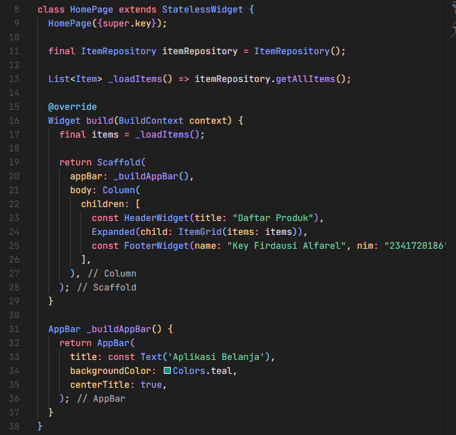
    </td>
    <td>
      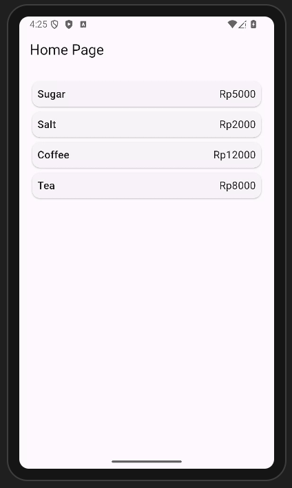 
      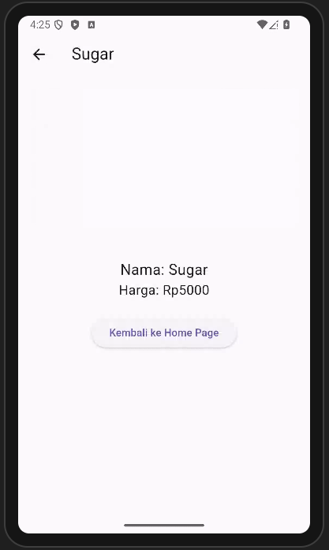
    </td>
  </tr>
</table>

<!-- praktikum 6 -->

<b>praktikum-06</b>

<table>
  <tr>
    <td align="center"><b>Kode</b></td>
    <td align="center"><b>Output</b></td>
  </tr>
  <tr>
    <td></td>
    <td></td>
  </tr>
</table>

<!-- tugas praktikum 2 -->
<!-- praktikum 5.1 -->
---

<b>tugas praktikum-02</b>

<table>
  <tr>
    <td align="center"><b>Kode</b></td>
    <td align="center"><b>Output</b></td>
  </tr>
  <tr>
    <td>
      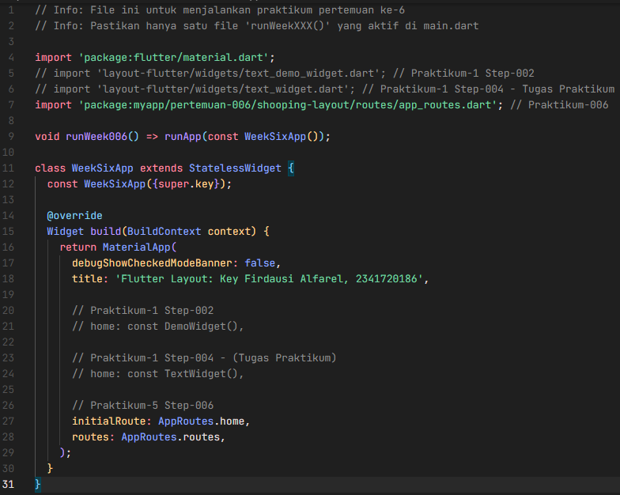
    </td>
    <td>
      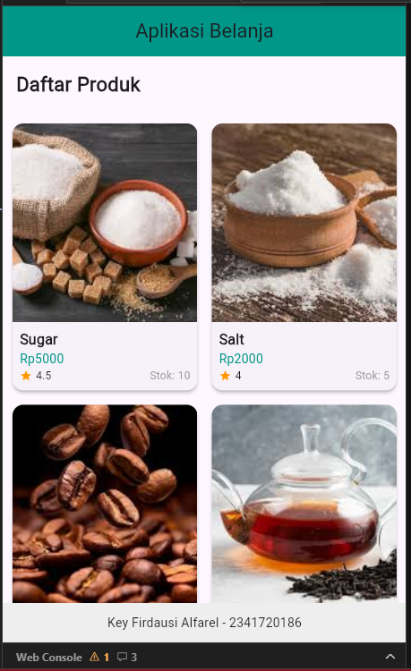 
      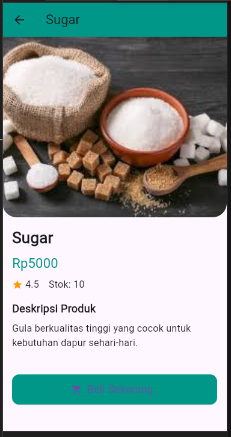
    </td>
  </tr>
</table>